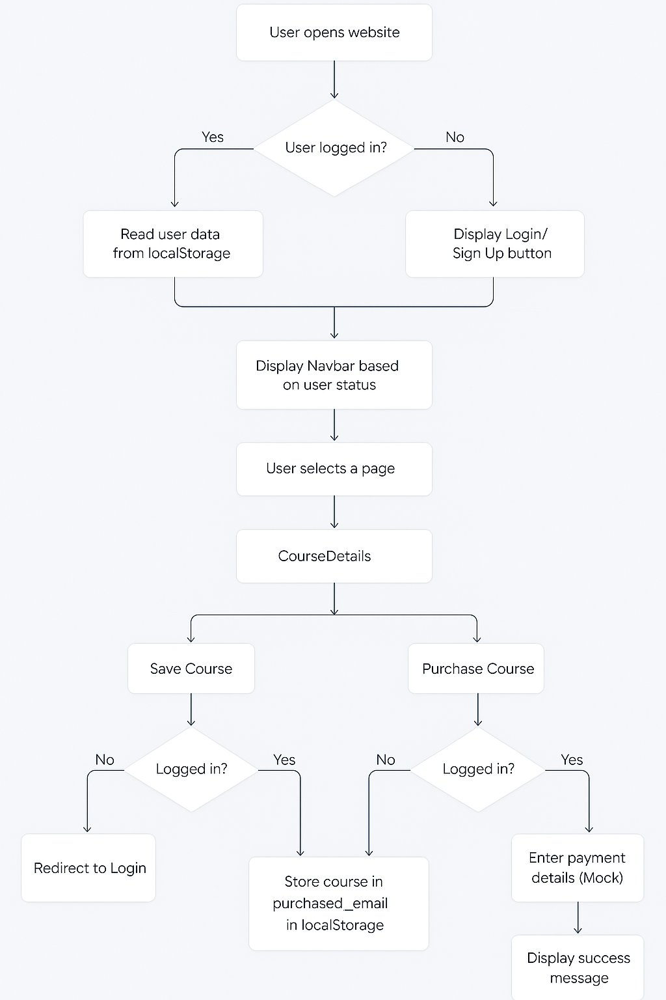
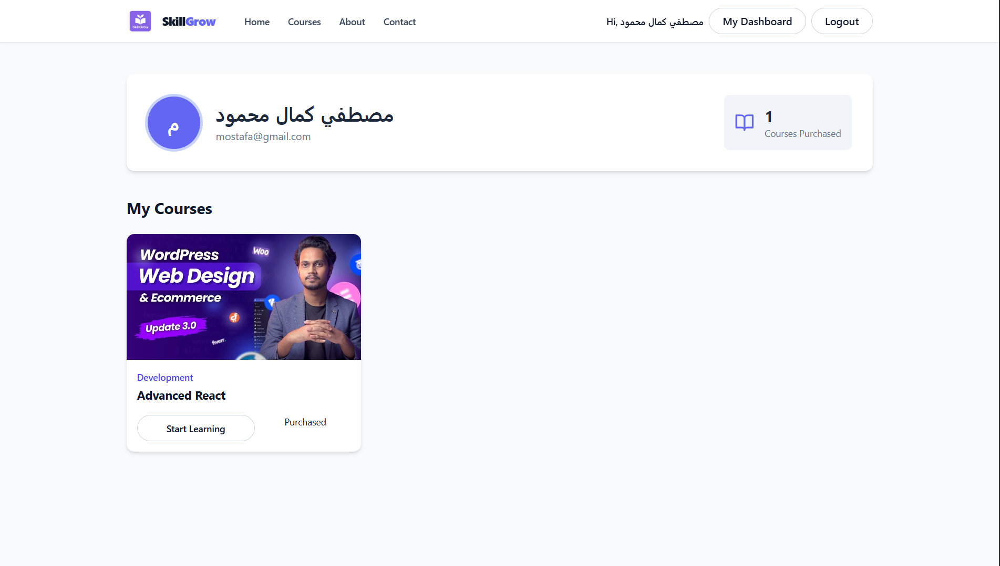
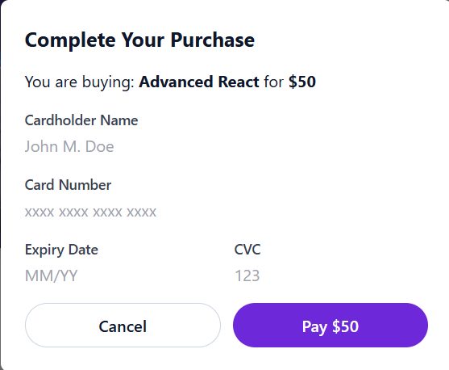
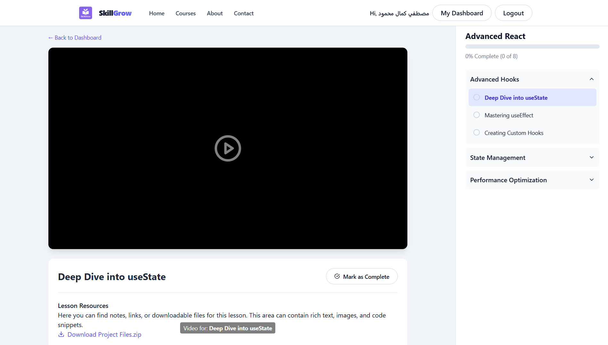
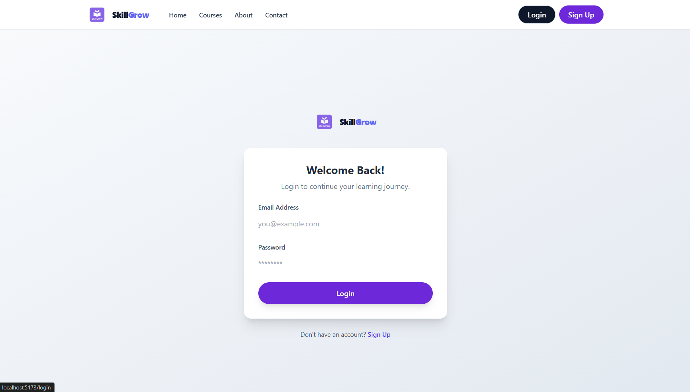
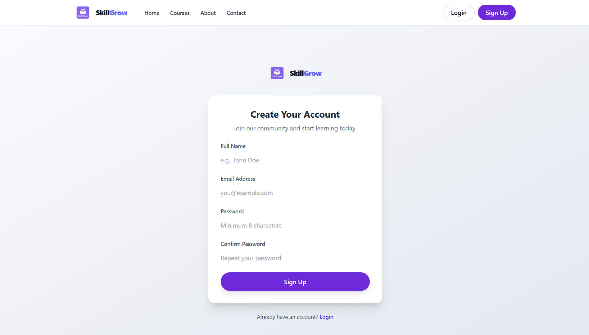

# 🎓 SkillGrow


**SkillGrow** is a modern educational platform built with React and Tailwind CSS.  
It allows users to **browse courses**, **save favorites**, **purchase courses**, and **manage authentication** — all stored locally using `localStorage`.

---
## 🔄 Flowchart



---

## 🚀 Features

- **User Authentication**
  - Register new accounts.
  - Login with existing credentials.
  - Persistent session using `localStorage`.

- **Course Management**
  - Browse all available courses.
  - Save favorite courses (requires login).
  - Purchase courses via a simple payment modal (requires login).
  - Purchased courses are stored per user.

- **Responsive Design**
  - Mobile-friendly navigation menu.
  - Styled with **Tailwind CSS**.

- **State Management**
  - Local state via React `useState` and `useEffect`.
  - Cross-component state updates via `CustomEvent` (`authChanged`).

---
---

## 🖼️ Screenshots

> Below are some preview screenshots of **SkillGrow** in action:

### 🏠 Homepage  
  
*Landing page with featured courses and clean navigation.*

### 📚 Courses Page  
  
*Browse all available courses with filtering and details.*

### 💳 Purchased Page  
  
*View all the courses you have purchased, along with your personal profile information in one place.*


### 💳 Payment Modal  
  
*Simple modal for course purchase confirmation.*

### 📘 Course Details Page  
  
*Explore full information about a specific course, including title, description, price, and the option to save or purchase it.*

### ▶️ Course Player Page  
  
*Access and watch your purchased course content, including videos, lessons, and downloadable resources, all within a structured player interface.*

### 🔑 Authentication (Login / Register)  
  
  

*Users can either register for a new account or log in with existing credentials. Sessions are stored in localStorage to keep them signed in across visits.*  

**Features:**  
- ✅ Dedicated Login and Register pages  
- ✅ Secure form validation  
- ✅ Persistent session using localStorage  
- ✅ Automatic redirect to dashboard after login  

---
## 🛠 Tech Stack

| Technology         | Purpose |
|--------------------|---------|
| **React.js**       | Core front-end framework |
| **React Router**   | Page navigation & routing |
| **Tailwind CSS**   | Styling & layout |
| **React Icons**    | UI icons |
| **localStorage**   | Client-side data persistence |
| **CustomEvent**    | Cross-component communication |

---

## 📂 Project Structure

```
src/
├── components/       # Reusable UI components (Navbar, CourseCard, etc.)
├── data/             # Static course data
├── lib/              # Helper functions (auth, course management)
├── pages/            # Main application pages
├── images/           # Assets and thumbnails
└── App.jsx           # Main application entry
```

---

## ⚙️ Installation & Setup

1. **Clone the repository**
   ```bash
   git clone https://github.com/your-username/skillgrow.git
   cd skillgrow
   ```

2. **Install dependencies**
   ```bash
   npm install
   ```

3. **Start the development server**
   ```bash
   npm run dev
   ```

4. Open in browser:
   ```
   http://localhost:5173
   ```

---

## 🧪 How to Use

1. **Register** a new account from the Sign-Up page.
2. **Login** with your email and password.
3. Browse courses from the **Courses** page.
4. Click **Save Course** to bookmark it.
5. Click **Buy Course** to purchase.
6. Access your **Saved** courses via the navigation bar.

---

## 📜 License

This project is open-source and free to use for educational purposes.
